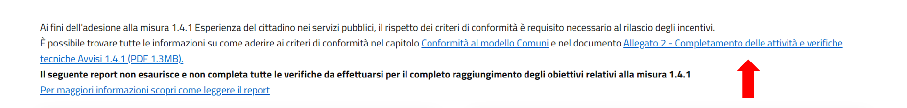

Il report e i risultati
=======================

Una volta effettuata l’analisi, il report si aprirà automaticamente.

Il report è composto da:

1. Banner superiore
2. Indicazione della documentazione di riferimento
3. Panoramica del risultato
4. Dettaglio dei risultati
5. Banner inferiore

.. figure:: media/report-completo.png
   :alt: Le informazioni di dettaglio per ogni test riguardante i criteri di conformità.
   :name: criteri-conformita

   Le informazioni di dettaglio per ogni test riguardante i criteri di conformità.

Barra superiore
----------------------

Nel banner superiore del report trovi:

1. il dominio del sito web che è stato scansionato;
2. data e ora in cui il report è stato generato;
3. la versione dell'app di valutazione.

   Le informazioni di dettaglio per ogni test riguardante i criteri di conformità.

Documentazione di riferimento
---------------------------------
Al di sotto della barra superiore, trovi i riferimenti ai documenti ufficiali della Misura 1.4.1 su cui si basano le verifiche effettuate durante la scansione.

Panoramica del risultato
---------------------------
In questa sezione del report, sotto forma di rappresentazione grafica, trovi:

1. il risultato generale della scansione;
2. il dettaglio dei criteri di conformità superati, divisi per pacchetto, espresso in percentuale (ad esempio 100%, 60%, 0%, ecc.) e in numeri (ad esempio, 9 criteri su 9 superati, 16 criteri su 20 superati, ecc.).

.. figure:: media/risultato-generale-positivo.png
   :alt: Le informazioni di dettaglio per ogni test riguardante i criteri di conformità.
   :name: criteri-conformita

Il risultato generale è *positivo* nel caso in cui tutti i criteri siano stati superati e il grafico presenterà un “OK” bianco in un cerchio verde. 

.. figure:: media/risultato-generale-positivo.png
   :alt: Le informazioni di dettaglio per ogni test riguardante i criteri di conformità.
   :name: criteri-conformita

Nel caso in cui anche solo un criterio non sia superato, il risultato generale sarà *negativo* e il grafico presenterà un “KO” bianco in un cerchio rosso.

.. figure:: media/risultato-generale-negativo.png
   :alt: Le informazioni di dettaglio per ogni test riguardante i criteri di conformità.
   :name: criteri-conformita

Nel caso in cui una o più pagine presentino errori di navigazione che impediscono la scansione dei criteri, il risultato generale sarà *fallito per errore (negativo)* e il grafico presenterà una “X” rossa in un cerchio bianco.

