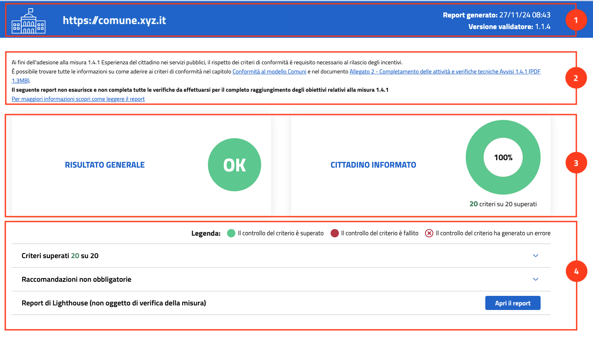
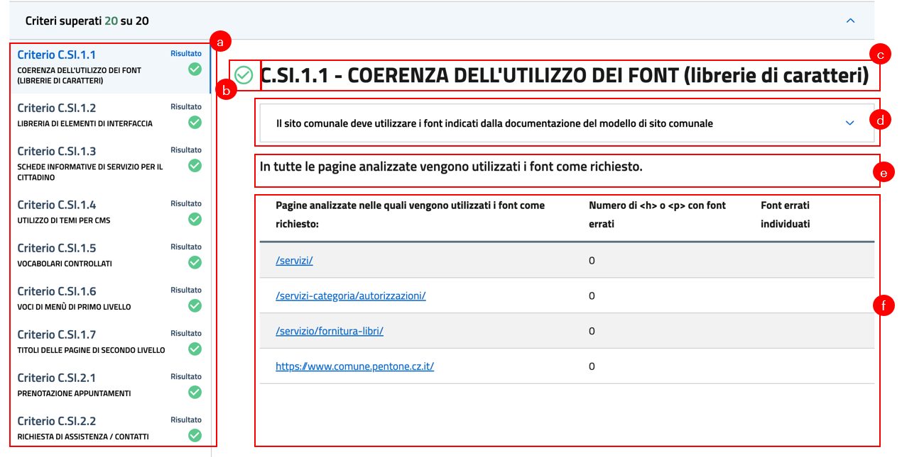

Il report e i risultati
=======================

Il report è composto da:

1. Barra superiore
2. Indicazione della documentazione di riferimento
3. Panoramica del risultato
4. Dettaglio dei risultati

Barra superiore
----------------------

Nella barra superiore del report trovi:

1. il dominio del sito web che è stato scansionato;
2. data e ora in cui il report è stato generato;
3. la versione dell'app di valutazione.

.. figure:: media/report-barra-superiore.png
   :alt: La barra superiore del report.
   :name: barra-superiore-report

Documentazione di riferimento
---------------------------------
Al di sotto della barra superiore, trovi i riferimenti ai documenti ufficiali della Misura 1.4.1 su cui si basano le verifiche effettuate durante la scansione.

.. figure:: media/report-documentazione.png
   :alt: La sezione del report con la documentazione di riferimento.
   :name: report-documentazione

Panoramica del risultato
---------------------------
In questa sezione del report, sotto forma di rappresentazione grafica, trovi:

1. il risultato generale della scansione;
2. il dettaglio dei criteri di conformità superati, divisi per pacchetto, espresso in percentuale (ad esempio 100%, 60%, 0%, ecc.) e in numeri (ad esempio, 9 criteri su 9 superati, 16 criteri su 20 superati, ecc.).

Il risultato generale è *positivo* nel caso in cui tutti i criteri siano stati superati e il grafico presenterà un “OK” bianco in un cerchio verde. 

Nel caso in cui anche solo un criterio non sia superato, il risultato generale sarà *negativo* e il grafico presenterà un “KO” bianco in un cerchio rosso.

Nel caso in cui una o più pagine presentino errori di navigazione che impediscono la scansione dei criteri, il risultato generale sarà *fallito per errore (negativo)* e il grafico presenterà una “X” rossa in un cerchio bianco.

.. figure:: media/risultato-generale-errore.png
   :alt:  La sezione con la panoramica di un risultato con errori.
   :name: risultato-generale-errore

Dettaglio dei risultati
--------------------------
Nella sezione del dettaglio dei risultati trovi, in alto, la **legenda** che indica come vengono segnalati i **controlli superati (verde)**, **falliti (rosso)** e **con errore (simbolo X rosso)**.

Sotto la leggenda trovi una serie di sezioni espandibili con:

1. i dettagli dei controlli che hanno generato errori;
2. i dettagli dei criteri non superati;
3. i dettagli dei criteri superati;
4. i dettagli delle raccomandazioni non obbligatorie;
5. il link al report di lighthouse, che non è oggetto di verifica della misura ma offre indicazioni su prestazioni e accessibilità del sito.

Espandendo un accordion, trovi:

(a) la lista dei controlli per quella categoria con un bollino che mostra il risultato della scansione per ogni controllo (a).

Al clic su un elemento della lista, trovi:

(b) il bollino del risultato del controllo (b) - spunta verde se superato, punto esclamativo rosso se fallito;
(c) il codice e il nome del controllo (c);
(d) il dettaglio del controllo (d), che puoi espandere per approfondire i requisiti di successo, le modalità di verifica e i riferimenti normativi;
(e) il resoconto del controllo (e) - testo che riporta la presenza di errori nelle pagine scansionate. Nel caso in cui ci siano raccomandazioni che risultano non essere superate, il testo riporta la presenza di errori nelle pagine scansionate
(f) una tabella di dettaglio con ulteriori informazioni sul risultato (f).

.. attention ::

   Non tutti i criteri e le raccomandazioni presentano le stesse informazioni sui risultati, ma variano a seconda dei requisiti richiesti.

.. attention ::

   Nel caso in cui la pagina che presenta un errore sia la homepage del sito, la scansione risulterà fallita. Il report riporterà i criteri che non è stato possibile verificare, ma non verranno presentati la lista dei criteri superati e il report di Lighthouse.

